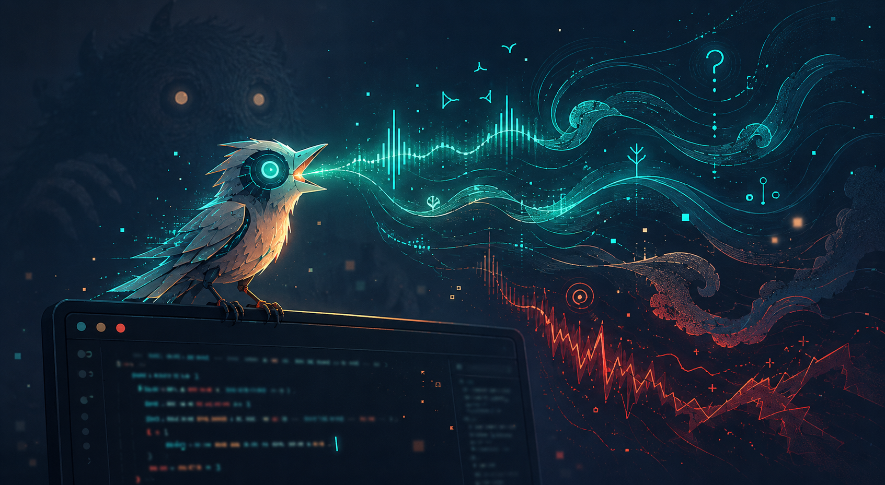

A familiar for your Claude Code sessions — a small creature that watches what you cannot see and speaks up. A hook reads the tail of the session transcript, runs it through local embeddings, and plays a short organic creature call (or musical motif) that tells you what the session needs and how it's going — without looking at the screen.

A triumphant whoop means tests went green. A low growl means something broke — the deeper the growl, the bigger the trouble. Insistent croaks mean the session is blocked waiting on you. Over a few dozen hearings, you stop translating and just *know*.

## Requirements

- macOS (uses `sox` for synthesis and `afplay` for playback)
- Python 3.10+ (stdlib only — no pip installs)
- [sox](https://sox.sourceforge.net/)
- [ollama](https://ollama.com) running locally, for embeddings
- [Claude Code](https://claude.com/claude-code)

## Installation

### 1. Prerequisites

**Homebrew** (skip if you have it):

```bash
/bin/bash -c "$(curl -fsSL https://raw.githubusercontent.com/Homebrew/install/HEAD/install.sh)"
```

**sox** — the synthesizer:

```bash
brew install sox
sox --version   # should print SoX vXX.Y.Z
```

**Python 3.10+** — macOS usually has it; check, and install via brew if missing:

```bash
python3 --version || brew install python3
```

**ollama** — local embeddings. Install it, *start it*, then pull the model:

```bash
brew install ollama
brew services start ollama          # or just open the Ollama app
ollama pull all-minilm              # 46MB embedding model

# verify it's serving:
curl -s localhost:11434/api/tags | grep all-minilm && echo OK
```

> If ollama isn't running, musicbox silently falls back to a cruder
> lexicon-based analysis — it still makes sounds, they're just less smart.

### 2. Setup

```bash
git clone https://github.com/rickgorman/claude-familiar ~/work/claude-familiar
ln -s ~/work/claude-familiar ~/.claude/musicbox

cd ~/.claude/musicbox
python3 build_anchors.py   # embeds affect axes + texture bank (~1s, needs ollama up)
python3 build_bank.py      # optional: note bank for the legacy --engine bank fallback
```

### 3. Smoke test

```bash
echo "all tests pass, shipped to production" \
  | python3 ~/.claude/musicbox/musicbox.py play --mode creature
```

You should hear a happy whoop-chirp within ~300ms. If you hear nothing:

| symptom | fix |
|---|---|
| silence, no error | check output device + volume; try `MUSICBOX_VOLUME=1.0` |
| `sox: command not found` in stderr | `brew install sox` |
| `phrase` output shows `"source": "bow"` | ollama not serving — `brew services start ollama` |
| `FileNotFoundError: anchors.embedded.json` | run `python3 build_anchors.py` |

### 4. Wire into Claude Code

Merge into the `hooks` section of `~/.claude/settings.json` (create the file with `{"hooks": {...}}` if it doesn't exist; if you already have `Stop`/`Notification` hooks, append to their arrays):

```json
"Notification": [
  { "matcher": "", "hooks": [
    { "type": "command", "command": "~/.claude/musicbox/hook.sh" }
  ]}
],
"Stop": [
  { "matcher": "", "hooks": [
    { "type": "command", "command": "~/.claude/musicbox/hook.sh" }
  ]}
]
```

`Stop` infers the call from the transcript tail. `Notification` always plays the blocked-waiting-on-you croak. Hooks are snapshotted at session launch — **restart Claude Code sessions to pick this up**.

## Quick Start

### 1. Hear it

```bash
echo "all tests pass, shipped to production" | python3 musicbox.py play --mode creature
echo "FATAL segfault, production is down"    | python3 musicbox.py play --mode creature
echo "should I take the locking approach or the queue approach?" | python3 musicbox.py play --mode creature
```

### 2. Inspect what it heard

```bash
echo "still failing with the same constraint violation" | python3 musicbox.py phrase --mode creature
```

Returns the full analysis: need, valence, arousal, certainty, familiarity, trajectory movement, loop detection, and the composed events.

### 3. Tune

```bash
MUSICBOX_VOLUME=0.5        # playback volume (default 0.35)
MUSICBOX_EMBEDDER=hashing  # ollama (default) | http | hashing
MUSICBOX_HTTP_URL=...      # your own local embedding endpoint
```

## The Vocabulary

| you hear | it means | need |
|---|---|---|
| descending coo-coo | task finished, settled | nothing |
| whoop + rising chirps | big win | come enjoy it |
| rising chirps ("mrrp?") | question waiting — more chirps = more thought required | answer when ready |
| insistent croak-barks + hanging chirp | session blocked on you | come now |
| low growl (+snarls) | something broke — lower = bigger stakes | look |
| tiny peep | status blip, work continues | ignore freely |
| fading hoots | heading into long background work | check back later |
| purring | doing the same thing repeatedly | maybe unstick it |

Inflection carries the rest: pitch wobble = the session is uncertain; body size = stakes; speed/brightness = urgency; a whole-tone strangeness = unfamiliar territory for this session; rising/falling grace notes = things trending better/worse.

## Modes

- `--mode creature` — organic animal calls (the default in `hook.sh`)
- `--mode duet` — two creatures: the session and its adversary, with dominance dynamics (victory, confrontation, retreat, petition, standoff)
- `--mode vocab` — musical motifs on synth pads, same vocabulary
- `--mode full` / `--mode pad` — earlier genre-groove and pad experiments, kept for fun

## How it works

1. `hook.sh` receives the hook event, tails the last ~1000 chars of the transcript
2. `embedder.py` embeds it via ollama (~20ms warm)
3. `musicbox.py` projects the embedding onto affect axes (valence, arousal, certainty, progress), texture directions (locality: similar moods sound similar), and the session's own trajectory (drift, trend, loops — stored in `state.json`)
4. A call is composed — need word + inflection — and synthesized through `sox` patches (`synth.py`), mixed in pure-stdlib Python, played via `afplay`
5. Total latency ~250-300ms, fire-and-forget

## Future Ideas

- **Formant vowels** - Chain bandpass resonances to give calls vowel-like vocal tract color.

- **Rate limiting** - Suppress status peeps when they'd fire more than once a minute; silence is part of the vocabulary.

- **Anchor growth** - Log embeddings that land far from the affect axes and mine them for new axis poles; the vocabulary adapts to your actual work.

- **Duet hook** - `Stop` plays the solo creature, but big dominance swings (victory, retreat) could summon the second creature.

- **Resident daemon** - A warm process would cut the ~250ms to sub-100ms and enable layered, evolving calls.

- **Real instruments** - The vocab mode would sound far richer through fluidsynth + a soundfont.

## License

MIT
